```mermaid
sequenceDiagram
    autonumber

    %% =========================================================
    %% Actors
    %% =========================================================
    participant Dev   as Developer
    participant Init  as init-layer.sh
    participant BB    as Bitbake / Yocto
    participant SSL   as OpenSSL
    participant Srv   as Update Server
    participant SW    as Device · SWUpdate
    participant UBoot as Device · U-Boot
    participant Cmit  as Device · checkUpdateOTA


    %% =========================================================
    %% PHASE 1 — Layer Setup  (one-time)
    %% =========================================================
    rect rgb(210, 225, 255)
        Note over Dev, BB: PHASE 1 — Layer Setup (one-time per project)

        Dev  ->> Init  : cp layer.config.example layer.config
        Note over Dev  : Edit: PROJECT_NAME, MACHINES, HW_IDS,<br/>EMMC_DEVICE, BASE_IMAGE, ENABLE_SIGNING …

        Dev  ->> Init  : ./init-layer.sh layer.config
        Init ->> Init  : Validate config (array lengths, partition numbers, paths)
        Init -->> BB   : Generate conf/layer.conf
        Init -->> BB   : Generate swupdate_%.bbappend (per-machine hwrevision + install rules)
        Init -->> BB   : Generate per-machine: 09-swupdate-args, swupdate.cfg
        Init -->> BB   : Generate update-image.bb + sw-description (per machine)
        Init -->> BB   : Copy static scripts (update-post.sh, ab-slot.sh,<br/>ota-update.sh, checkUpdateOTA.sh)

        Dev  ->> BB    : Add meta-swupdate + meta-swupdate-ab to bblayers.conf
        Dev  ->> BB    : Add to image: swupdate, check-update-ota, libubootenv-bin
        Dev  ->> BB    : Add IMAGE_FSTYPES += " ext4.gz"
    end


    %% =========================================================
    %% PHASE 2 — Key Management  (one-time, or on rotation)
    %% =========================================================
    rect rgb(255, 235, 200)
        Note over Dev, BB: PHASE 2 — RSA Key Management (one-time · ENABLE_SIGNING=yes)

        alt GENERATE_KEYS = yes
            Init ->> SSL   : openssl genrsa 4096
            SSL  -->> Init : keys/swupdate_priv.pem  (private — stays on build host)
            Init ->> SSL   : openssl rsa -pubout
            SSL  -->> Init : keys/swupdate_public.pem
        else Bring your own keys
            Dev  ->> Init  : Place priv + pub keys in keys/
        end

        Init -->> BB : Copy swupdate_public.pem → recipes-support/.../swupdate/
        Note over BB : Public key is baked into the device image at /etc/swupdate_public.pem
        Note over Dev: Private key NEVER leaves the build host
    end


    %% =========================================================
    %% PHASE 3 — Build
    %% =========================================================
    rect rgb(210, 255, 220)
        Note over Dev, BB: PHASE 3 — Build

        Dev ->> BB  : bitbake <BASE_IMAGE>
        BB  ->> BB  : Compile userspace, install packages<br/>(includes: swupdate daemon, ota-update CLI,<br/>checkUpdateOTA service, /etc/hwrevision,<br/>/etc/swupdate_public.pem, /etc/swupdate.cfg)
        BB  -->> Dev: <BASE_IMAGE>-<machine>.ext4  →  compressed to .ext4.gz

        Dev ->> BB  : bitbake update-image
        BB  ->> BB  : Collect artifacts into CPIO archive:<br/>sw-description  +  <BASE_IMAGE>-<machine>.ext4.gz  +  update-post.sh

        alt ENABLE_SIGNING = yes
            BB  ->> SSL : Sign CPIO with swupdate_priv.pem
            SSL -->> BB : Append RSA signature block to .swu
        end

        BB -->> Dev : update-image-<machine>.swu  →  tmp/deploy/images/<machine>/
    end


    %% =========================================================
    %% PHASE 4 — Distribution
    %% =========================================================
    rect rgb(245, 215, 255)
        Note over Dev, Srv: PHASE 4 — Distribution (choose one method)

        alt HTTP / S3 / OTA Server (Hawkbit etc.)
            Dev ->> Srv : Upload .swu to server
            Srv -->> SW : Device polls for update OR server pushes notification
        else USB Drive
            Dev ->> SW  : Copy .swu to USB → plug into device
        else Direct transfer
            Dev ->> SW  : scp .swu  root@<device-ip>:/tmp/
        end
    end


    %% =========================================================
    %% PHASE 5 — Installation on Device
    %% =========================================================
    rect rgb(255, 250, 210)
        Note over SW, UBoot: PHASE 5 — Installation on Device

        SW  ->> SW  : Receive .swu<br/>(web UI push · ota-update CLI · USB · HTTP download)

        alt ENABLE_SIGNING = yes
            SW  ->> SW  : Verify RSA signature using /etc/swupdate_public.pem
            SW  --x SW  : ABORT — signature invalid or key mismatch
        end

        SW  ->> SW  : Read /etc/hwrevision  →  "<HW_ID> <HW_VERSION>"
        SW  ->> SW  : Compare against sw-description hardware-compatibility list
        SW  --x SW  : ABORT — hardware version not in compatibility list

        SW  ->> SW  : Stream + write <BASE_IMAGE>-<machine>.ext4.gz<br/>directly to inactive partition (installed-directly=true)

        SW  ->> SW  : Run update-post.sh (postinst hook)<br/>· Mount newly written partition<br/>· Copy /etc/NetworkManager configs → preserve network settings<br/>· Run e2fsck -a -f  (filesystem integrity check)<br/>· Run resize2fs -f  (expand fs to fill partition)<br/>· Unmount + sync

        SW  ->> UBoot : fw_setenv rootfspart  = <new partition number>
        SW  ->> UBoot : fw_setenv mmcroot     = <new device path> rootwait rw
        SW  ->> UBoot : fw_setenv upgrade_available = 1   (opens rollback window)
        SW  ->> UBoot : fw_setenv bootcount   = 0
        SW  ->> SW    : Execute postupdatecmd → reboot
    end


    %% =========================================================
    %% PHASE 6 — Boot, Commit or Rollback
    %% =========================================================
    rect rgb(210, 255, 250)
        Note over UBoot, Cmit: PHASE 6 — Boot Sequence · Commit or Rollback

        UBoot ->> UBoot : Read rootfspart → mount new partition
        UBoot ->> UBoot : upgrade_available = 1 → bootcount++ → saveenv

        alt New system boots and all services start
            UBoot -->> Cmit : Kernel + systemd start on new partition
            Cmit  ->> UBoot : fw_printenv upgrade_available  →  "1"
            Cmit  ->> Cmit  : Run health checks in /etc/ota-health.d/ (all must pass)
            Cmit  ->> UBoot : fw_setenv upgrade_available = 0
            Cmit  ->> UBoot : fw_setenv bootcount = 0
            Note over Cmit  : Update COMMITTED ✓  Rollback window closed
        else Boot fails (kernel panic / critical service crash)
            UBoot ->> UBoot : Next reboot: bootcount++ again
            Note over UBoot : When bootcount > bootlimit …
            UBoot ->> UBoot : Switch rootfspart back to previous partition
            UBoot ->> UBoot : fw_setenv upgrade_available = 0
            UBoot ->> UBoot : fw_setenv bootcount = 0
            Note over UBoot : ROLLBACK ✓  Device boots last known-good version
        end
    end
```

# End-to-End Process Diagram

This diagram covers the full lifecycle: from adding this layer to your Yocto
project, through building and signing the update package, distributing it, and
what happens on the device during installation and rollback.

> Render with any Mermaid-compatible viewer:
> VS Code (Markdown Preview Mermaid Support extension), GitHub, GitLab, or
> https://mermaid.live

---



---

## Phase Summary

| # | Phase | Who runs it | Frequency |
|---|-------|------------|-----------|
| 1 | Layer Setup | Developer on build host | Once per project |
| 2 | Key Management | Developer / CI | Once (rotate periodically in production) |
| 3 | Build | Bitbake / CI pipeline | Every release |
| 4 | Distribution | CI / ops team | Every release |
| 5 | Installation | SWUpdate on device | Every update |
| 6 | Boot + Commit | U-Boot + checkUpdateOTA | Every reboot after update |

---

## Key Safety Properties

```
+------------------------------------+------------------------------------------+
| If signature check fails (phase 5) | Update aborted. Device unchanged.        |
| If HW mismatch (phase 5)           | Update aborted. Device unchanged.        |
| If power lost during write (ph. 5) | Active partition intact. Reboot = same.  |
| If new OS fails to boot (phase 6)  | U-Boot rolls back automatically.         |
| If rollback guard fails (phase 6)  | bootcount > bootlimit → U-Boot reverts.  |
+------------------------------------+------------------------------------------+
```
